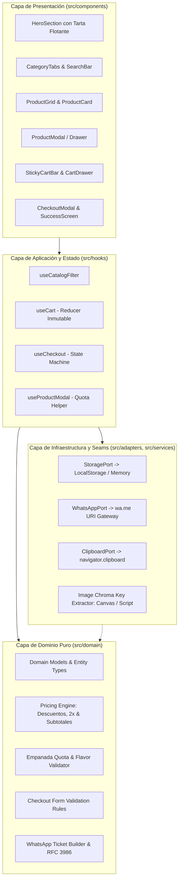

# tech-plan.md - Plan Técnico y Arquitectura de Software
## Proyecto: La Exquisita - Menú Online & Pedidos WhatsApp

---

## 1. Visión Técnica y Principios de Diseño

El objetivo de esta arquitectura es materializar el menú interactivo de alta conversión para "La Exquisita", garantizando una experiencia de usuario instantánea y mobile-first, mientras que a nivel de ingeniería se asegura una base de código robusta, extensible y mantenible.

### Principios Rectores:
1. **Clean Architecture en Frontend:** Separación estricta entre las reglas puras del dominio gastronómico y los detalles de infraestructura (DOM, React, LocalStorage, Web APIs).
2. **Deep Modules (Módulos Profundos - John Ousterhout):** Cada módulo presenta una interfaz externa pequeña, intuitiva y difícil de usar incorrectamente, ocultando una complejidad interna significativa (cálculo de promociones, normalización de cuotas de empanadas, compilación RFC 3986 de WhatsApp).
3. **Costuras (Seams) e Inversión de Control (Michael Feathers):** Los puntos de contacto con I/O impuro (`window.localStorage`, `navigator.clipboard`, `window.open` de WhatsApp, manipulación de Canvas para Chroma Key) se aíslan mediante puertos/adaptadores para permitir pruebas automatizadas sin mocks globales invasivos.
4. **Inmutabilidad y Determinismo:** El estado del carrito y las validaciones de checkout son funciones puras. Dado el mismo estado de entrada, la salida monetaria y el mensaje de WhatsApp son idénticos al 100%.

---

## 2. Evaluación de Alternativas Arquitectónicas (Design It Twice)

### Alternativa A: Monolito de Componentes con Estado Mezclado (Spaghetti Hooks & Bloated UI)
* **Descripción:** Enfoque convencional rápido donde los componentes de React (`ProductCard`, `CartDrawer`, `CheckoutModal`) manejan directamente su lógica en hooks locales (`useState`, `useEffect`), acceden directamente a `localStorage`, realizan la matemática de descuentos en el render y concatenan el string de WhatsApp dentro del handler `onClick`.
* **Fortalezas Iniciales:** Fácil de iniciar en las primeras horas; no requiere pensar en contratos de capas ni abstracciones previas.
* **Debilidades Críticas:**
  - **Fragilidad en Reglas de Negocio:** La lógica de cuota de empanadas (ej. 6 para media docena, 12 para docena) queda dispersa en múltiples handlers de botones UI.
  - **Fallas en Promociones:** Las reglas 2x (Lomos XL, Hamburguesas, Chorilomos) requieren inspeccionar el carrito en el JSX, provocando duplicación de código e inconsistencias de precios entre el Drawer y el mensaje final de WhatsApp.
  - **Testabilidad Nula:** Para probar si el mensaje de WhatsApp codifica bien un pedido con milanesa napolitana y papas fritas, es obligatorio montar toda la UI con JSDOM, simular clicks y lidiar con el ciclo de vida de React.
  - **Riesgo Operativo:** Un cambio en la UI puede romper accidentalmente el cálculo del total o el formato del ticket de cocina.

### Alternativa B: Arquitectura por Capas con Módulos Profundos y Seams de I/O (Seleccionada)
* **Descripción:** División estricta en 4 capas desacopladas:
  1. **Domain Core (`src/domain/`):** Modelos, tipos de TypeScript inmutables, motor de cálculo de precios y combos, validador de cuotas de empanadas, validación de checkout y compilador de WhatsApp. Código TypeScript puro, sin React, sin DOM, ejecutable en Node/Vitest en < 5ms.
  2. **Application & Reactive State (`src/hooks/` y `src/store/`):** Custom hooks que orquestan el estado usando patrones de máquina de estados/reducers inmutables (`useCart`, `useCheckout`, `useCatalogFilter`), consumiendo el Domain Core y sincronizándose con adaptadores de persistencia.
  3. **Infrastructure & Adapters (`src/adapters/`, `src/services/`):** Adaptadores de persistencia (`localStorage`), pasarela de WhatsApp (`wa.me`), acceso a portapapeles y pipeline de procesamiento Chroma Key para la tarta.
  4. **Presentation & UI (`src/components/`):** Componentes visuales puros con estética Pop-Retro bodegón argentino, accesibles (WAI-ARIA), enfocados únicamente en recibir props, renderizar y emitir eventos.

### Matriz Comparativa:

| Criterio | Alternativa A (Monolito Mezclado) | Alternativa B (Capas + Deep Modules) | Vencedor |
| :--- | :--- | :--- | :--- |
| **Testabilidad Unitaria** | Pobre (requiere JSDOM y render de React). | Excelente (Domain Core testeable con Vitest puro en ms). | **Alternativa B** |
| **Integridad del Negocio** | Riesgo alto de discrepancias entre UI y WhatsApp. | Garantía del 100%: una sola fuente de verdad para precios y ticket. | **Alternativa B** |
| **Mantenibilidad a Largo Plazo** | Degenera en código espagueti con cada nueva promo. | Las promociones se agregan en `pricing.ts` sin tocar componentes. | **Alternativa B** |
| **Separación de Responsabilidades** | Componentes de 400+ líneas con estado, fetch y UI. | Componentes delgados (< 120 líneas) enfocados en presentación y a11y. | **Alternativa B** |
| **Resiliencia ante Fallos de I/O** | Si falla WhatsApp o Clipboard, la app se rompe. | Fallback elegante desacoplado mediante `ClipboardPort`. | **Alternativa B** |

**Decisión:** Se elige unánimemente la **Alternativa B**.

---

## 3. Arquitectura del Sistema & Diagrama de Flujo



---

## 4. Definición de Módulos Profundos (Deep Modules)

### 4.1. Módulo Profundo: `src/domain/` (Dominio Gastronómico Puro)

Este módulo es una librería pura de Typescript sin dependencias de React ni del navegador.

#### Estructura Interna:
- `models.ts`: Define las entidades de negocio inmutables (`Product`, `CartItem`, `CheckoutForm`, `OrderTicket`, etc.).
- `pricing.ts`:
  - Cálculo de variantes (Entera vs Media, Chica vs Grande).
  - Regla de promociones por volumen (2x en Lomos XL por $32.000, 2x Chorilomos por $19.000, 2x Hamburguesas Clásicas por $22.000, 2x La Exquisita por $25.000, 2x Miga Real por $26.000).
  - Cálculo de subtotales y totales.
- `empanada-rules.ts`:
  - `validateEmpanadaQuota(selection: FlavorSelection, expectedQuota: 6 | 12): QuotaValidationResult`
  - Control de incrementos y decrementos: impide sumar cuando el cupo está satisfecho.
  - Generador de resumen legible (ej: *"Carne (6), Árabes (4), Jamón y Queso (2)"*).
- `checkout-rules.ts`:
  - Validador estricto según `DeliveryMethod`:
    - Si `DELIVERY`: `street`, `number`, `betweenStreets` son obligatorios; `customerName` y `customerPhone` son obligatorios.
    - Si `PICKUP`: Solo `customerName` y `customerPhone` obligatorios; `pickupEstimatedTime` opcional.
  - Validación de `PaymentMethod`:
    - Si `EFECTIVO`: `cashAmountPaid` debe ser `>= total`. Calcula el vuelto: `changeAmount = cashAmountPaid - total`.
- `whatsapp-compiler.ts`:
  - Construye el ticket canónico exacto especificado en `CONTEXT.md` (con emojis, divisores punteados, desglose de ítems, modificaciones de guarnición y notas).
  - Genera la URI completa lista para abrir: `https://wa.me/5492664193004?text=${encodeURIComponent(ticket)}`.

#### Firma de la Interfaz del Módulo:
```typescript
// src/domain/index.ts
export * from './models';
export { calculateLineSubtotal, calculateCartTotals } from './pricing';
export { validateEmpanadaQuota, getRemainingQuota, formatFlavorSummary } from './empanada-rules';
export { validateCheckoutForm, calculateCashChange } from './checkout-rules';
export { buildCanonicalTicket, generateWhatsAppUrl } from './whatsapp-compiler';
```

---

### 4.2. Módulo Profundo: `src/services/image-processor/` (Chroma Key Pipeline)

Para procesar `tarta-jamon_y_queso-fondoverde.png` (fondo `#00FF00` saturado) y obtener el activo transparente para el Hero flotante:

#### Estrategia Dual:
1. **Script de Node (Build-Time / Pre-Processing):** Script autónomo que corre en Node o Python para generar el archivo estático `public/assets/hero-tarta-transparent.png`.
2. **Utilidad Runtime Fallback:** Algoritmo en JavaScript que renderiza en un `<canvas>` offscreen en el navegador sustituyendo píxeles verdes por transparencia y aplicando **Despill** (eliminación de reflejos verdes).

---

### 4.3. Módulo Profundo: `src/store/` y `src/hooks/` (Estado Reactivo Inmutable)

#### `useCart` (Hook de Carrito)
- **Responsabilidad:** Gestionar la lista de ítems en el carrito, asegurar persistencia en `localStorage`, calcular totales a través del Domain Core y generar hashes únicos para ítems configurados.
- **Identidad de Ítems (`lineId`):**
  Un ítem se identifica determinísticamente por producto + variante + modificadores + notas. Si el cliente agrega el mismo ítem con idénticos modificadores, se incrementa la cantidad; si cambia la nota o la guarnición, se crea una línea separada.

#### `useCheckout` (Hook de Checkout y Despacho)
- **Máquina de Estados de Checkout:**
  - `IDLE`: Formulario abierto.
  - `VALIDATING`: Verificación con `validateCheckoutForm`.
  - `SUBMITTING`: Preparación del payload de WhatsApp y guardado de backup.
  - `DISPATCHED_WHATSAPP`: Se abrió exitosamente `wa.me`.
  - `DISPATCHED_FALLBACK`: Se copió el texto al portapapeles.
  - `ORDER_SUCCESS`: Pedido completado, carrito vaciado y vista de confirmación.

---

### 4.4. Módulo Profundo: `src/components/` (Componentes UI Pop-Retro Bodegón)

#### Estética y Diseño Visual:
- **Atmósfera:** Bodegón argentino popular tradicional, con toques vintage modernos.
- **Paleta de Colores en Tailwind:**
  - `bg-amber-50` / `bg-[#FFFBEB]` para fondos cálidos de tarjetas ("papel manteca").
  - `brand-yellow`: `#F59E0B` (amarillo cálido mostrador).
  - `brand-red`: `#DC2626` (rojo tomate/sello rotisería).
  - `brand-dark`: `#111827` (negro carbón comanda).
  - Sombras duras estilo pop retro: `shadow-[4px_4px_0px_0px_#111827]`.
  - Badges dentados: Bordes tipo estampilla con tipografía bold condensada.

#### Componentes Clave:
1. `HeroSection`: Visualización de la tarta recortada con animación flotante CSS y sello retro *"¡Masa Casera La Exquisita!"*.
2. `CategoryNavbar`: Barra sticky horizontal con navegación por pills y scroll sincronizado.
3. `SearchBar`: Entrada de búsqueda en tiempo real con empty state temático (*"¡Acá no tenemos sushi, che! Pero mirate estas pizzas..."*).
4. `ProductCard`: Foto real provista con fallback temático, badges promocionales y precio en ARS.
5. `ProductModal`: Drawer accesible para seleccionar variantes de tamaño, guarnición obligatoria o cuota de empanadas por sabor.
6. `StickyCartBar`: Barra flotante inferior animada con contador de ítems y subtotal acumulado.
7. `CartDrawer`: Panel deslizable con desglose de ítems, stepper de cantidad y botón de checkout.
8. `CheckoutModal`: Toggle Delivery vs Retiro, campos condicionales y selector de pago con cálculo de vuelto.
9. `OrderSuccessModal`: Confirmación con número de ticket generado.

---

## 5. Costuras (Seams) e Inversión de Control para Testing Aislado

Puertos en `src/domain/ports/`:
- `StoragePort`: Abstracción de persistencia local.
- `WhatsAppGatewayPort`: Abstracción para apertura de `wa.me`.
- `ClipboardPort`: Abstracción para copia a portapapeles.
